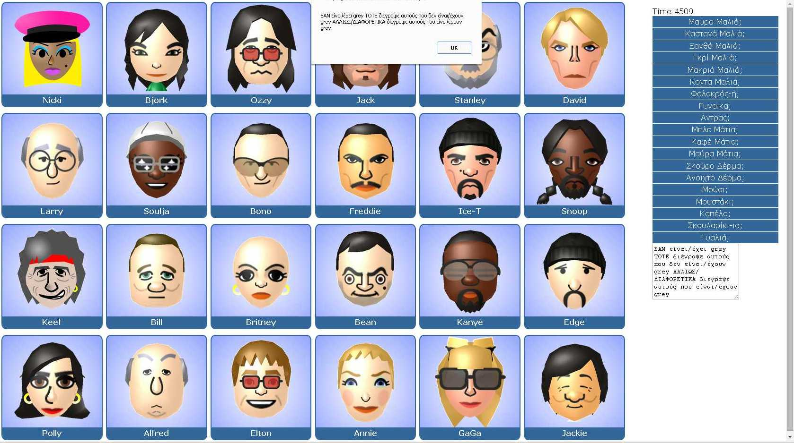

Faces Puzzle Game
==================

Faces is a JavaScript-powered guessing game. It's sort of not like 'Guess Who' at all. Not one iota.

It's based on a mechanic I wrote many years ago to accompany a radio mechnica called £1k Runaway that ran, I think on Power FM, with a version a year or so later on BRMB.

That was written in Flash/ActionScript and the second iteration had animated people, not just faces - it looked a lot less like the MB Games version of Guess Who that I loved as a child.

Anyway, in early 2012 I came across an old notebook in which I'd written out how I was gogin to write the code in a concise way. I had a flashback to writing the notes whilst on the balcony of an apartment near Lake Garda in Italy.

I liked the notes, I liked the memory so I thought I'd tackle writing the code again. It was a fun little pject that I lazily hacked at in the evenings whilst watching the TV.

In all likelihood I'll never polish it to the level of a finished product. But I like having it around.

Changes:
-20160315-Added faces-code.html : Shows greek command IF..THEN..ELSE
-20160310-Added faces-notime.html : faces with much time (practically no time)

